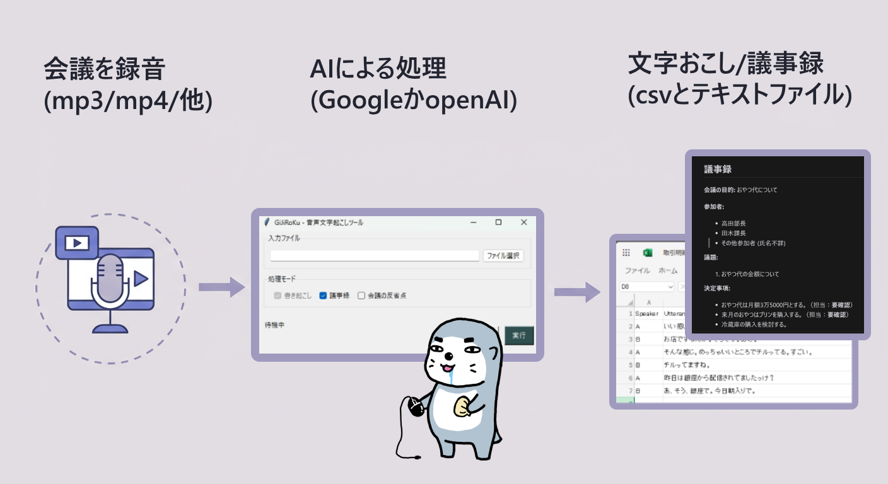

# AI議事録作成アプリ（GiJiRoKu）

会議や講演の音声/動画ファイルから自動的に議事録を作成するAI議事録君です
(Meeting Minutes App)

## 🌟 主な機能

- 音声/動画ファイルから会話内容を書き起こして議事録を作る
- 議事録まとめの自動生成（カスタマイズ可能）

## 🚀 かんたん使い方

#### Step 1: ダウンロード
1. [リリースページ](https://github.com/RentaroKai/AI_GiJiRoKu/releases)から最新の「GiJiRoKu.exe」をダウンロード
2. 好きな場所に保存

#### Step 2: 起動
1. 「GiJiRoKu.exe」をダブルクリックして起動
　※初回起動時、Windows Defenderのスマートスクリーン警告が表示される場合があります。その場合は「詳細情報」をクリックし、「実行」ボタンを選択してください。
2. 初回起動時は、APIキーの設定が必要です（詳しくは後述）

#### Step 3: ファイル選択
1. 「ファイル選択」ボタンをクリック
2. 議事録にしたい音声/動画ファイルを選択
   - 対応形式：音声（mp3, wav, m4a, aac, flac, ogg）、動画（mkv, avi, mov, flv）

#### Step 4: 実行
1. 必要に応じてオプションを外せる
   - 「議事録作成」: AIによる議事録まとめの生成
2. 「実行」ボタンをクリック

#### Step 5: 結果確認
作成された議事録は自動的に保存され、📁 ボタンで確認できます


## 🔑 APIキーの設定

このアプリはOpenAIのAPIキーまたはGeminiのAPIキーが必要です（どちらか一方でOK）。

### OpenAI APIキー
1. [OpenAIのウェブサイト](https://platform.openai.com/signup)でアカウント作成
2. [APIキーページ](https://platform.openai.com/api-keys)から「Create new secret key」をクリック
3. 作成したAPIキーをアプリの設定画面で入力または環境変数「OPENAI_API_KEY」に設定

### Google APIキー（Gemini方式用）
1. [GoogleのAI Studio](https://aistudio.google.com/app/apikey)でAPIキーを作成
2. 作成したAPIキーをアプリの設定画面で入力または環境変数「GOOGLE_API_KEY」に設定

## ⚙️ 設定画面の使い方

設定ボタンから開く設定画面では、議事録作成の細かい部分をカスタマイズできます。

### 📝 基本設定タブ

#### APIキー設定
- **OpenAI APIキー**: Whisper方式やGPT-4 Audio方式を使用する場合に必要
- **Google APIキー**: Gemini方式を使用する場合に必要

#### 処理方式の選択
- **書き起こし方式**:
  - **Whisper方式**: OpenAIの音声認識（安価・品質は低め）
  - **GPT-4 Audio方式**: OpenAIの高精度音声認識（10分で約30円・高品質）
  - **Gemini方式**: Googleの無料API（無料～・高品質）

- **議事録生成モデル**:
  - **OpenAI方式**: OpenAIのモデルを使用
  - **Gemini方式**: Googleのモデルを使用

#### その他の設定
- **分割処理用の秒数**: 長い音声を処理するための分割単位（推奨：300秒）
- **出力ディレクトリ**: 議事録の保存先

### 📋 議事録内容のカスタマイズ

「議事録の内容を指定」タブでは、AIに指示するプロンプトを自由に編集できます。
これにより、議事録に含めたい内容や形式を細かく指定できます。

- **議事録生成プロンプト**: どのような議事録を作成するか、AIへの指示内容
- **リセットボタン**: デフォルトのプロンプトに戻す

## ⚠️ 注意事項
- インターネット接続が必要です
- Googleの無料APIキーは学習に使われるため、会社で使うなら有料APIキーをご利用ください。
- 音声認識は100%正確ではありません。重要な会議では内容を確認してください
- 特に話者の割り当ては不完全ですのでご注意ください

## 🛠️ Pythonを使う場合のカスタマイズのやり方

### プロンプトファイルの直接編集
`src/prompts/` ディレクトリ内の以下のファイルを直接編集することもできます：

- `minutes.txt`: 議事録の作成方法と形式
- `reflection.txt`: 会議の振り返り分析の基準
- `transcription.txt`: 音声の書き起こし整形ルール
- `transcriptionGEMINI.txt`: 音声の書き起こし整形ルール（GEMINI方式）

### AIモデルの変更
`src/utils/` ディレクトリ内の以下のファイルでAIモデルを変更できます：

- `Common_OpenAIAPI.py`: OpenAIモデルの指定（`DEFAULT_CHAT_MODEL = "XXX"`）
- `gemini_api.py`: Geminiモデルの指定（`model_name="XXX"`）や最大文字数の変更

## 🔧 必要要件

- Windows 10以上
- Python 3.9以上（exeファイルを使用する場合は不要）

## 📦 必要なパッケージ

詳細は requirements.txt をご確認ください

## 🛠️ ビルド方法

```bash
pyinstaller GiJiRoKu.spec
```

## 📝 ライセンス情報

### AI_GiJiRoKu
MIT License

### FFmpeg
このソフトウェアは、FFmpeg（https://ffmpeg.org/）を使用しています。
FFmpegは以下のライセンスの下で提供されています：

- GNU Lesser General Public License (LGPL) version 2.1以降
- GNU General Public License (GPL) version 2以降

FFmpegのソースコードは以下から入手可能です：
https://ffmpeg.org/download.html

FFmpegは以下の著作権表示が必要です：
```
This software uses code of FFmpeg (http://ffmpeg.org) licensed under the LGPLv2.1 and its source can be downloaded from https://ffmpeg.org/
```
